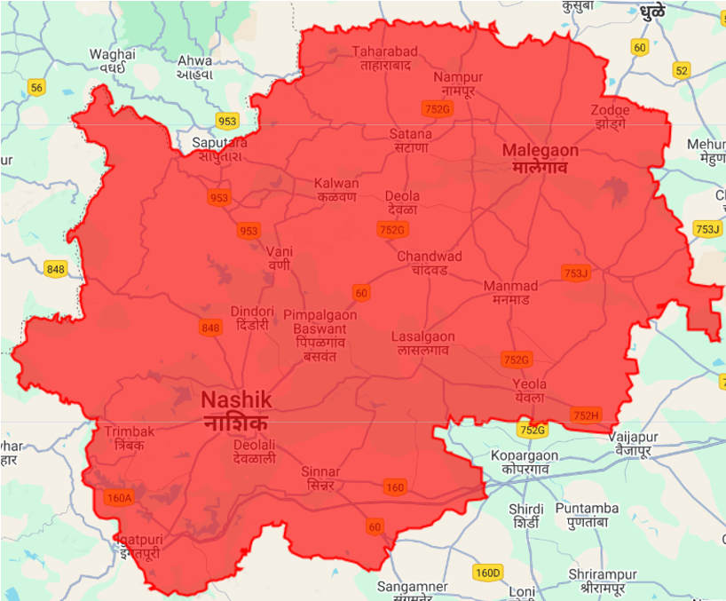
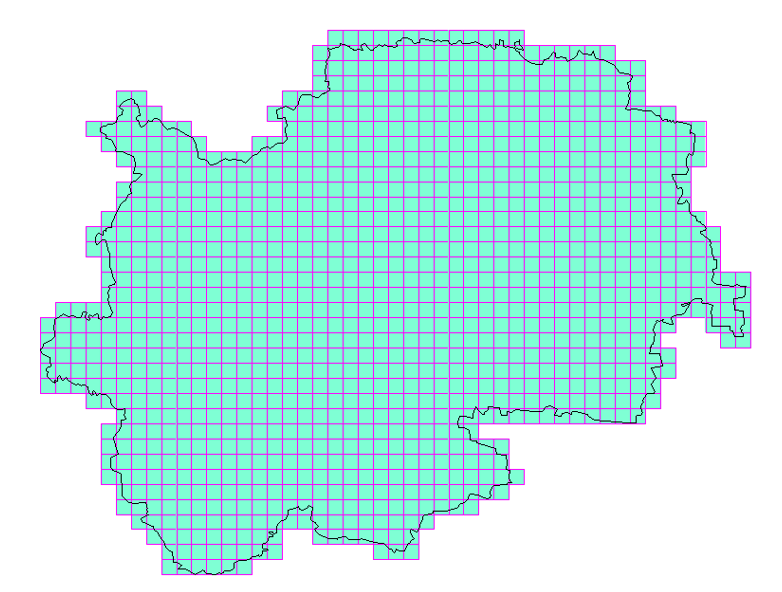
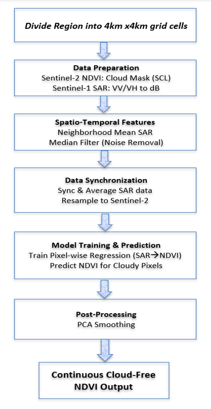
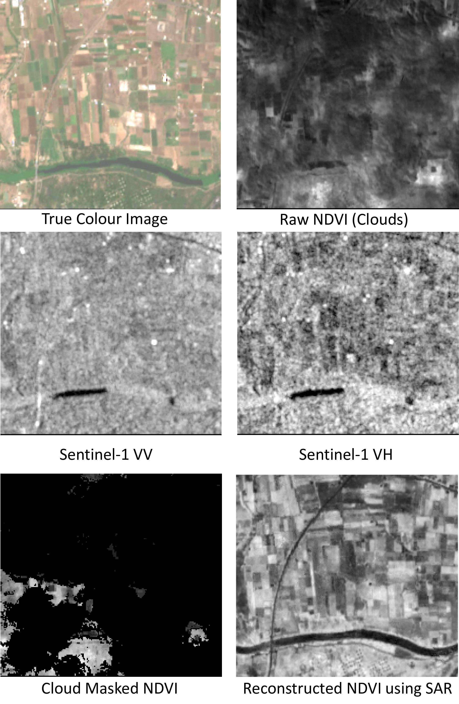
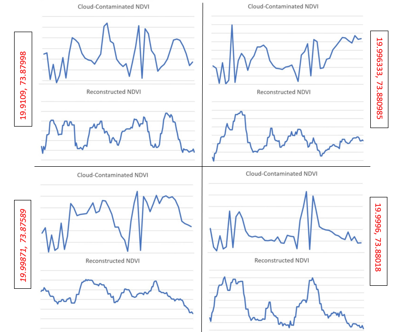

# Reconstruction of Sentinel-2 NDVI using Sentinel-1 (SAR) Data

This repository contains the code and configuration used to reconstruct cloud-contaminated NDVI time series by integrating Sentinel-1 Synthetic Aperture Radar (SAR) data with cloud-free Sentinel-2 optical imagery. The entire implementation is conducted within the Google Earth Engine (GEE) platform, allowing scalable and efficient restoration of vegetation indices, particularly in monsoon-affected regions.

---

## 📍 Study Area: Nashik District, Maharashtra

Nashik is a key agricultural zone in India known for grapes, sugarcane, onions, and soybeans. The area experiences heavy monsoon rains that hinder optical satellite observations. Its diverse cropping systems and cloud-prone climate make it ideal for evaluating SAR-optical NDVI fusion strategies.

### Grid-Based Scalability
- Nashik divided into **1150 grids of 4×4 km**
- Each grid processed independently in GEE for parallelism

  
*Fig 1: Grid wise whole district (1150 grids of 4x4km)*

  
*Fig 2: Grid wise whole district (1150 grids of 4x4km)*

---

## 🛰️ Satellite Datasets Used

### Sentinel-1 (SAR)
- Mode: Interferometric Wide (IW) Swath
- Resolution: 10 m (VV and VH polarizations)
- Revisit Frequency: 6 days
- Source: Google Earth Engine (GRD format, converted to dB scale)

### Sentinel-2 (Optical)
- Resolution: 10 m (Bands 4 and 8 for NDVI)
- NDVI = (NIR - Red) / (NIR + Red)
- Cloud Mask: Scene Classification Map (SCL) from Sen2Cor algorithm

---

## 🧠 Spatio-Temporal Feature Partitioning

SAR predictors are decomposed into:
- Global temporal mean
- Local temporal mean (neighborhood)
- Global spatial residuals
- Local spatial residuals

This partitioning enables the **Multiple Linear Regression (MLR)** model to capture both large-scale and fine-scale NDVI variation. Each pixel is modeled independently, using its localized SAR-derived features.

---

## ⚙️ Methodology for NDVI Restoration

  
*Fig 3: Process workflow for SAR-optical NDVI reconstruction*

### Workflow Phases:
1. **Data Preparation**  
   - NDVI calculated using Bands 4 & 8 of Sentinel-2  
   - Cloud masking using SCL  
   - Sentinel-1 SAR converted to dB  

2. **Spatio-Temporal Feature Generation**  
   - Local and global SAR mean extraction  
   - Median filtering to suppress speckle  

3. **Data Synchronization**  
   - Sentinel-1 and Sentinel-2 aligned spatially and temporally (±12 days)

4. **Model Training & NDVI Prediction**  
   - Pixel-wise linear regression using SAR predictors

5. **Post-Processing**  
   - Savitzky-Golay smoothing  
   - Calibration to match observed NDVI range  
   - Gap filling in NDVI time series  

---

## 📊 Results & Discussion

- The approach successfully reconstructs NDVI under frequent cloud contamination
- Vegetation cycles (growth, senescence) are preserved

  
*Fig 4: Reconstructed NDVI Image for the time period July 1–15, 2023*

- Reconstructed NDVI shows strong alignment with actual vegetation trends
- Enhanced spatial clarity in agricultural zones and stress detection

  
*Fig 5: NDVI Profiles of 4 different points before and after reconstruction*

---

## ✅ Model Validation

### Data Split:
- **Training**: 70% clear-sky data  
- **Testing**: 20% unseen NDVI  
- **Validation**: 10% synthetic cloud mask

### Evaluation Metrics:
| Metric     | Training | Testing | Validation |
|------------|----------|---------|------------|
| MAE        | 0.061    | 0.074   | 0.065      |
| CC         | 0.89     | 0.87    | 0.91       |

The results show strong temporal consistency and spatial fidelity in vegetation behavior, confirming the effectiveness of SAR-optical regression fusion.

---

## 🧾 Conclusion

This NDVI reconstruction framework provides a scalable and practical solution for gap-filling in vegetation monitoring. By leveraging SAR data and spatio-temporal modeling, it overcomes limitations of cloud-obstructed optical datasets, especially in monsoon climates.

The approach generalizes well, is easily scalable to large regions, and can support precision agriculture, environmental monitoring, and climate-resilient planning.

---

## 🚀 Installation

### 1️⃣ Create a Google Earth Engine account
Sign up at [Google Earth Engine](https://earthengine.google.com/) and verify access.

### 2️⃣ Set up Python environment (PyCharm recommended)
Create a new Python project in PyCharm or any IDE of your choice.

### 3️⃣ Install required libraries and dependencies
Open terminal and run:
```bash
pip install earthengine-api geopandas pandas shapely json
```

### 4️⃣ Authenticate Earth Engine
In Python, run:
```python
import ee
ee.Authenticate()
ee.Initialize()
```

### 5️⃣ Import required Python modules
Make sure the following modules are available: `earthengine-api`, `geopandas`, `pandas`, `shapely`, `json`.

---

## 📖 Usage

1. Update the configuration file (`Parameters.json`) with your **Area of Interest (AOI)**, **date range**, and **project title**.  

2. Then execute the following from your project directory:
```bash
cd scripts
python sar_optical_ndvi_reconstruction.py
```

The outputs will be saved to your Google Drive under the folder name specified by `PROJECT_TITLE` in your configuration file.

---

## 📚 References

1. Xia, Y. et al., 2019. *Cloud Removal of Optical Remote Sensing Imagery with Multitemporal Sar-Optical Data Using X-Mtgan.* IGARSS.
2. Yang, K. et al., 2022. *Reconstruction of Sentinel-2 image time series using Google Earth Engine.* Remote Sens.
3. Zeng, C. et al., 2013. *Recovering missing pixels for Landsat ETM+ SLC-off imagery using multi-temporal regression analysis.* RSE.
4. Zhang, Q. et al., 2020. *Thick cloud and shadow removal using spatio-temporal patch group deep learning.* ISPRS J. Photogramm. Remote Sens.

---

## ✍️ Author & Acknowledgements

**Author**: Rohit Kumar Sarkar  
**Institute**: Techno India University, Kolkata  
**Guide**: Dr. Niraj Priyadarshi, Sci/Engr-SF, RRSC-East, NRSC/ISRO  

> This work would not have been possible without the insightful guidance, support, and encouragement of Dr. Niraj Priyadarshi.
